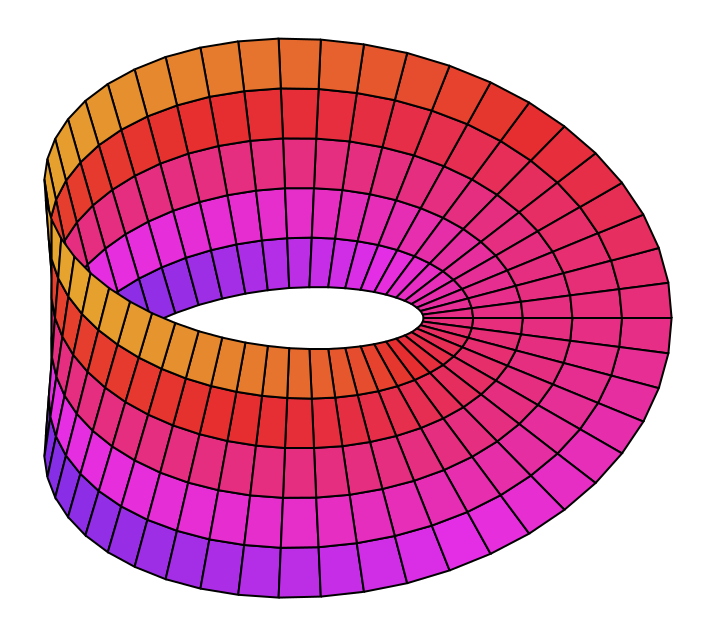

# Moebious

ML algorithms benchmarking and synthetic data generation framework

<p align="center">

</p>

## Installation

### PIP

Work in progress...

### Docker

```bash
git clone https://github.com/D3lph1/moebius.git moebius && cd moebius
```

```bash
docker-compose up -d
```

## Usage

See examples of usage in `tutorials` folder.

## Attribution

[Image](https://commons.wikimedia.org/wiki/File:Moebius_strip.svg) of Moebius strip by 	Krishnavedala /
[CC BY](https://commons.wikimedia.org/wiki/User:Krishnavedala)

## License

This code is published under the [MIT license](https://opensource.org/licenses/MIT). This means you
can do almost anything with it, as long as the copyright notice and the accompanying license file
is left intact.
